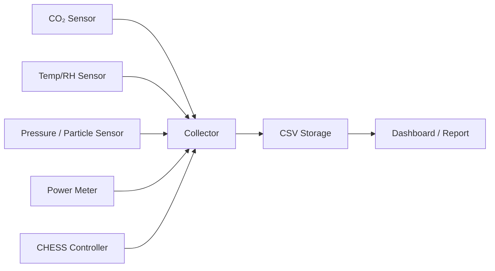

# CHESS 데이터 수집 설계

## 1. 목적

이 문서는 CHESS 실증에서 필요한 센서 및 전력 데이터를 어떤 형식으로 수집하고 저장할지 정의한다.

CHESS 제어 시스템은 CO₂ 농도, 온습도, 차압, 입자 농도 등을 기반으로 외기 댐퍼와 AHU 팬 인버터를 제어한다. 본 수집 모듈은 제어 결과가 실제 에너지 절감으로 이어졌는지를 검증하기 위해 운전 데이터를 시간 단위로 기록한다.

## 2. 수집 구조



## 3. 데이터 소스

현재 코드는 세 가지 소스를 지원한다.

| source type | 용도 | 상태 |
|---|---|---|
| `simulated` | 현장 장비 없이 개발 테스트 | 구현 |
| `http` | 센서 게이트웨이 또는 Edge API에서 JSON 수집 | 구현 |
| `csv_replay` | 과거 CSV 데이터를 한 줄씩 재생 | 구현 |

추후 Modbus TCP, MQTT, OPC-UA, InfluxDB write API 등을 추가할 수 있다.

## 4. HTTP 데이터 예시

HTTP source는 다음과 같은 JSON 응답을 기대한다.

```json
{
  "co2": 742,
  "temperature": 22.6,
  "rh": 49.1,
  "pressure": 12.2,
  "particles": 2100,
  "damper": 28,
  "fan_hz": 44,
  "power": 14.8,
  "energy": 10536.2
}
```

`config.example.yaml`의 `field_map`을 사용하면 현장 게이트웨이의 필드명을 표준 필드명으로 변환할 수 있다.

## 5. CSV 저장 필드

| 필드 | 단위 | 설명 |
|---|---:|---|
| `timestamp` | ISO 8601 | 측정 시각 |
| `site_id` | - | 현장 ID |
| `ahu_id` | - | AHU ID |
| `co2_ppm` | ppm | 실내 CO₂ 농도 |
| `outdoor_co2_ppm` | ppm | 외기 CO₂ 농도 |
| `temperature_c` | °C | 실내 온도 |
| `relative_humidity_pct` | %RH | 상대습도 |
| `differential_pressure_pa` | Pa | 차압 |
| `particle_count` | count/m³ | 입자 농도 |
| `damper_position_pct` | % | 외기 댐퍼 개도율 |
| `fan_frequency_hz` | Hz | 인버터 주파수 |
| `fan_speed_pct` | % | 기준 속도 대비 팬 속도 |
| `fan_law_power_ratio` | - | Fan Law 기반 전력 잔존율 |
| `power_kw` | kW | 순간 전력 |
| `energy_kwh` | kWh | 누적 전력량 |
| `operation_mode` | - | baseline/control/alarm |
| `alarm_code` | - | 알람 코드 |
| `validation_errors` | - | 범위 검증 경고 |

## 6. Fan Law 검증

수집기는 `fan_speed_pct`가 존재하면 다음 값을 함께 저장한다.

```text
fan_law_power_ratio = (fan_speed_pct / 100)^3
```

예를 들어 팬 속도가 70%이면 전력 잔존율은 `0.7³ = 0.343`이다. 이는 전력 사용량이 기준의 34.3% 수준이라는 뜻이며, 절감율은 65.7%이다.

현장에서는 덕트 저항, 필터 차압, 인버터 효율, 차압 유지 조건, 온습도 부하 때문에 실측값이 이론값과 다를 수 있다. 따라서 저장된 `fan_law_power_ratio`는 성과값이 아니라 이론 기준선으로 사용한다.

## 7. 실행 예시

```bash
pip install -r requirements.txt
python -m chess_monitoring.cli --config config.example.yaml --once --print-json
```

지속 수집은 다음과 같이 실행한다.

```bash
python -m chess_monitoring.cli --config config.example.yaml
```

## 8. 다음 개발 단계

1. 실제 전력계 프로토콜 결정
2. Modbus TCP 또는 MQTT source 추가
3. SQLite/TimescaleDB 저장 backend 추가
4. Grafana 또는 Streamlit 대시보드 구성
5. Before/After 절감율 자동 리포트 생성
